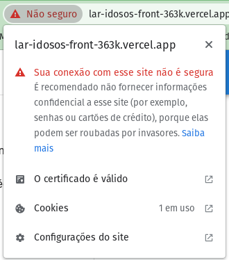
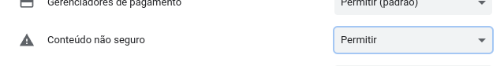

# Lar Idosos Front

Essa aplicação se refere ao front-end da aplicação Lar de Idosos, utilizando NextJs, ReactJs e Typescript.

## Como executar em ambiente dev

1. Criar um arquivo `.env.local` com as seguintes variáveis:
   1. `NEXT_PUBLIC_API_URL` com o endereço da API do back-end

## Prod
Disponível nos endereços:
1. https://lar-idosos-front-363k.vercel.app

**IMPORTANTE**: como a api não tem um certificado SSL, ela está em um protocolo HTTP, porém o front-end da aplicação está em HTTPS, por conta disso o seu browser poderá bloquear a requisição. Para contornar isso, você deve desabilitar a verificação de certificado SSL no seu browser.

## Desabilitar SSL no Chrome
1. Clique no ícone de cadeado no canto esquerdo da barra de endereço

2. Clique em "Configurações do site"
3. Em "Permissões" encontre "Conteúdo não seguro" e troque para "Permitir"

